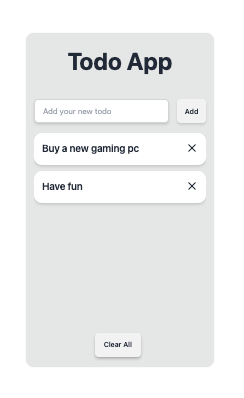

# FastAPI + Jinja2 + HTMX + Docker - TODO App Showcase

## Overview

This project is a simple showcase of a TODO App implemented using FastAPI, HTMX, Jinja2 with DaisyUI, and Tailwind CSS. The goal is to demonstrate the efficiency and synergy of these technologies in a web application.



### Technologies Used

1. **FastAPI**

   - FastAPI is a modern, fast (high-performance), web framework for building APIs with Python 3.8+ based on standard Python type hints.

2. **HTMX**

   - HTMX is a lightweight JavaScript library for creating dynamic, seamless user interfaces. It allows for updating parts of a webpage using AJAX requests, providing a smooth user experience.

3. **Jinja2**

   - Jinja2 is a template engine for Python that simplifies the process of integrating dynamic content into web applications. It enables the creation of dynamic templates, allowing developers to seamlessly blend Python logic with HTML for efficient and maintainable code.

4. **Tailwind CSS with DaisyUI**
   - Tailwind CSS is a utility-first CSS framework that provides low-level utility classes to build designs directly in your markup. DaisyUI, as an extension to Tailwind CSS, enriches the framework with additional components and features, offering a comprehensive toolkit for crafting modern and responsive user interfaces with ease.

### Features

- List TODO items
- Create new TODO items
- Remove specific TODO items
- Clear all TODO items

### Development Setup

To build the application and its dependencies:

```bash
make build
```

To start the application:

```bash
make up
```

Go to http://localhost:8000 in the browser to see the app in action!

To shut down the application:

```bash
make down
```

To run tests (ensure the application is running first):

```bash
make tests
```

### Makefile Commands

- `update-deps`: Update project dependencies.
- `build`: Build the Docker image with the application.
- `up`: Start the application and its dependencies.
- `down`: Shut down the application.
- `attach`: Attach to the running application container.
- `bash`: Open a bash shell in the running application container.
- `run-build`: Build and run the application without using Docker Compose.
- `run`: Run the application in a Docker container.
- `run-tests`: Run tests in a Docker container.

### Pre-commit Hooks

The project uses pre-commit with the following hooks:

- `autoflake`: Removes unused imports and variables.
- `flake8`: Checks for PEP 8 compliance and code style.
- `isort`: Sorts import statements.
- `black`: Formats code using the Black code formatter.

### Security

`CORS Protection`:
Cross-Origin Resource Sharing (CORS) is a security feature that controls which web domains are permitted to access resources from your web application, preventing unauthorized cross-origin requests.
